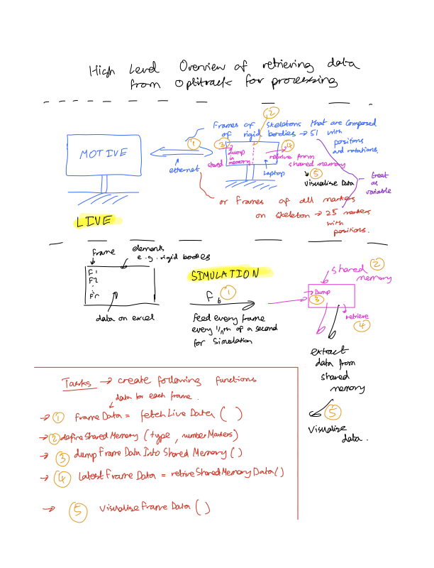

# BrainMachineInterfaces
A repo to manage my 4th year project work on Brain Machine Interfaces

This project uses a set of cameras to locate markers/rigid bodies/skeletons in a 3D space space. The data is pre-processed by the Optitrack software, then can be accessed by a pc and used for further analysis. Possible avenues this project could take involve applications such as tracking body movements to predict mood and enabling participants to communicate and map their spatial actions to machines.

Week 1 and 2 has focused on looking at possible ideas of where to take this project and learning to capture data for rigid bodies and markers. Week 3 is about learning to stream the data from optitrack for live visualisation and the image below shows how this will be tackled

